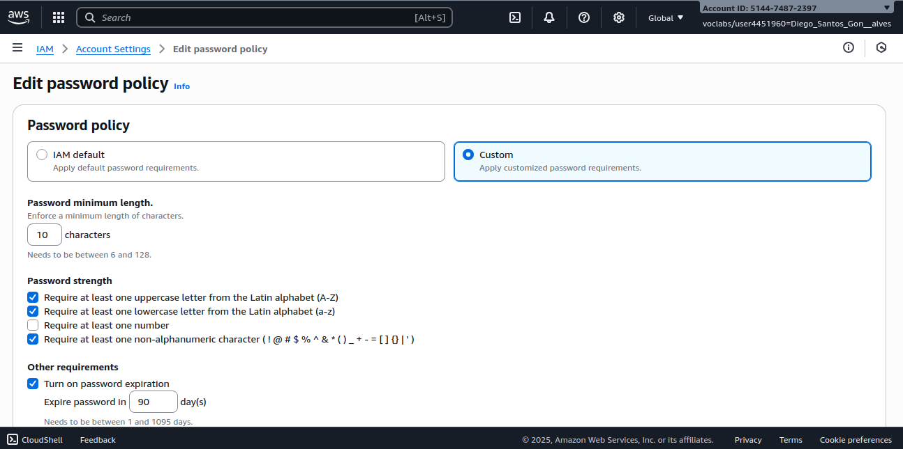
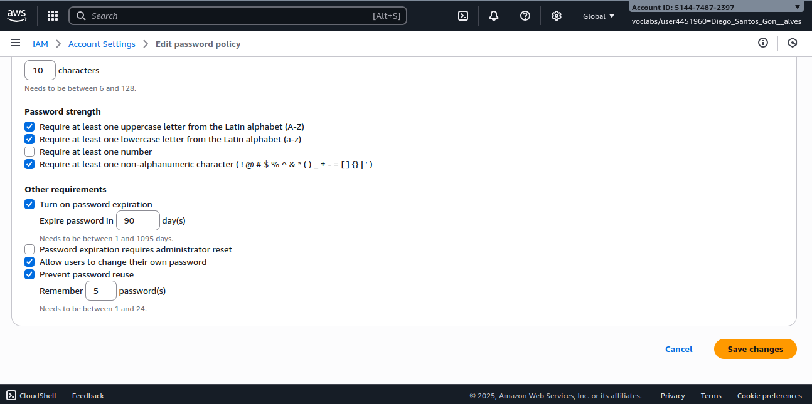
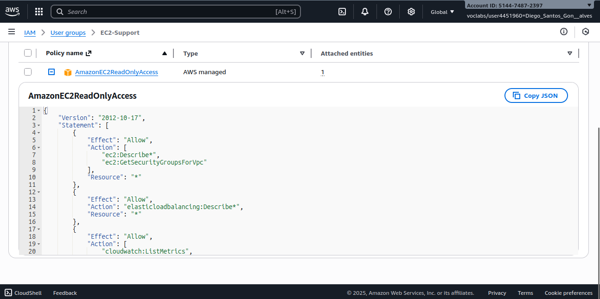
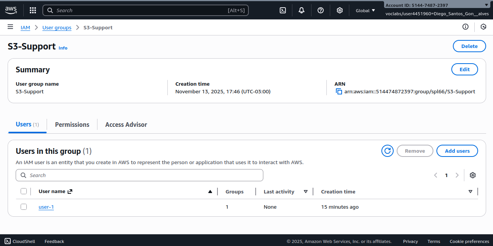
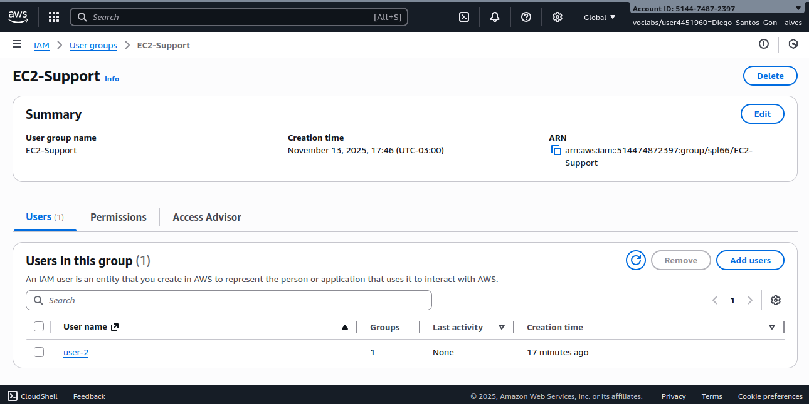
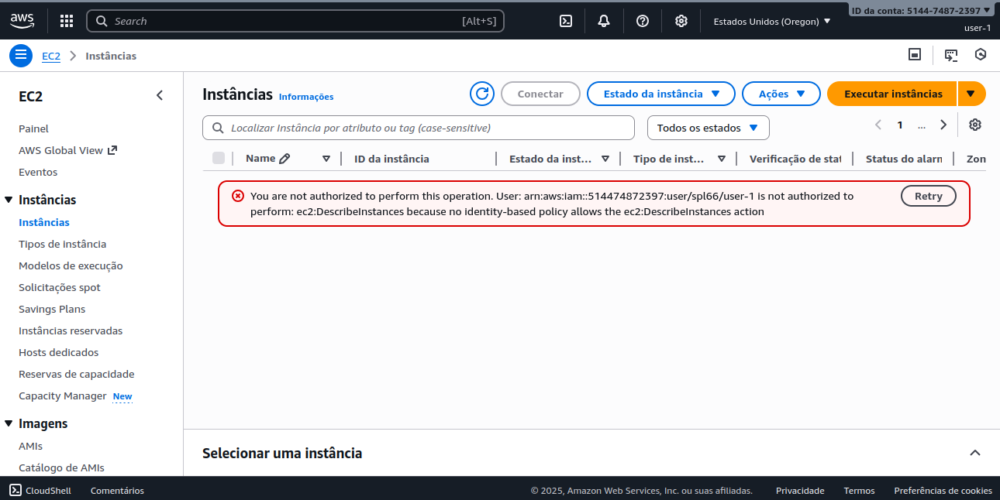
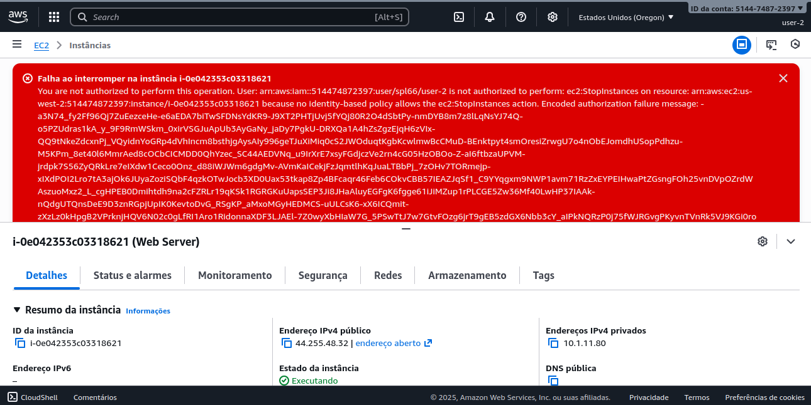
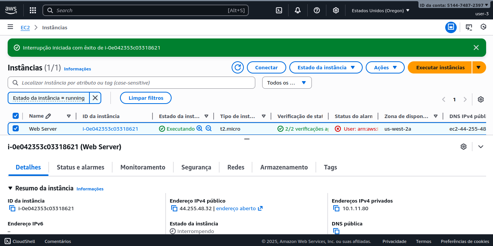
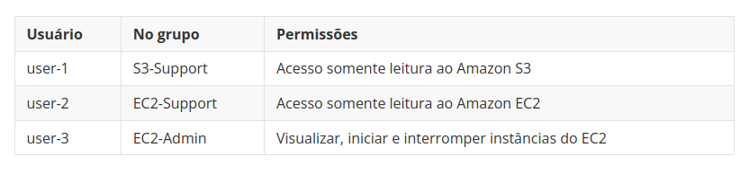

# 🔐 Documentação: Introdução ao AWS Identity and Access Management (IAM)

Este repositório contém minha documentação prática do laboratório **“Introdução ao AWS IAM”**, realizado como parte das atividades do programa **AWS re/Start - Escola da Nuvem ☁️**.

O objetivo do laboratório foi compreender o gerenciamento de usuários, grupos e permissões na AWS, aplicando o princípio do menor privilégio e testando na prática os efeitos das políticas.

---

## 🧠 Habilidades Adquiridas

* Criação e configuração de políticas de senha no IAM
* Exploração de usuários e grupos IAM pré-criados
* Identificação de políticas gerenciadas e inline
* Associação de usuários a grupos específicos
* Teste prático de permissões com login de diferentes usuários

---

## 🛠️ Tecnologias Utilizadas

<div align="left">
  

---

## 📁 Estrutura do Repositório

`conhecendo-IAM-AWS`

```
├── imagens/
└── README.md
```

---

## 🧩 Cenário do Laboratório

O ambiente de laboratório forneceu 3 usuários IAM e 3 grupos com permissões distintas para realizar testes práticos:

| Usuário  | Grupo IAM     | Permissões                                          |
| :------- | :------------ | :-------------------------------------------------- |
| `user-1` | `S3-Support`  | Leitura de buckets e objetos no Amazon S3           |
| `user-2` | `EC2-Support` | Visualização de instâncias EC2 (read-only)          |
| `user-3` | `EC2-Admin`   | Controle total sobre instâncias EC2 (inline policy) |

---

## 🖥️ Etapas Realizadas

### 1. Criando e Aplicando a Política de Senhas

No console do **IAM**, foi configurada uma política de senha para toda as contas da AWS:

* **Tamanho mínimo:** 10 caracteres
* **Exigir:** letras maiúsculas, minúsculas, números e caracteres especiais
* **Permitir alteração de senha pelo usuário**
* **Expiração:** 90 dias
* **Evitar reuso das últimas:** 5 senhas anteriores

#### Tela de configuração:





---

### 2. Explorando Usuários e Grupos

Acessei o menu **Users** e selecionei `user-1` para visualizar suas permissões.
Observei que o usuário não possui políticas diretas aplicadas.


Depois, em **User groups**, analisei os grupos disponíveis:

* `EC2-Admin`
* `EC2-Support`
* `S3-Support`

Cada grupo possui diferentes tipos de políticas:

* `S3-Support`: política gerenciada **AmazonS3ReadOnlyAccess**
* `EC2-Support`: política gerenciada **AmazonEC2ReadOnlyAccess**
* `EC2-Admin`: política **inline** com permissões de controle total em EC2

#### Exemplo de tela de permissões do grupo EC2-Support:



---

### 3. Associando Usuários aos Grupos

Cada usuário foi adicionado ao seu respectivo grupo:

| Usuário  | Grupo Adicionado |
| :------- | :--------------- |
| `user-1` | `S3-Support`     |
| `user-2` | `EC2-Support`    |
| `user-3` | `EC2-Admin`      |

#### Tela de adição de usuários a grupos:






---

### 4. Testando as Permissões de Cada Usuário

Para os testes, foi utilizado o **IAM user sign-in link** da conta em janelas anônimas separadas.

#### 🔹 user-1 (S3-Support)

* ✔Acesso bem-sucedido ao **Amazon S3**
* ✔Conseguiu listar e visualizar buckets
* ❌Tentativa de acessar EC2 resultou em **Access Denied**



---

#### 🔹 user-2 (EC2-Support)

* ✔Acesso ao **Amazon EC2** autorizado apenas para visualização
* ❌Não foi possível parar ou iniciar instâncias



---

#### 🔹 user-3 (EC2-Admin)

* ✔Permissão total sobre instâncias EC2 (inline policy)
* ✔Conseguiu parar e iniciar instâncias



---

## 🧩 Resultado Final

O teste prático confirmou o funcionamento correto das políticas IAM:



---

## 🔐 Lições Aprendidas

* Aplicar o **princípio do menor privilégio** garante segurança e controle.
* Políticas **inline** são úteis para exceções específicas.
* O **IAM** centraliza o controle de autenticação e autorização de recursos.
* O uso de **grupos** facilita o gerenciamento em larga escala.
* Políticas de senha fortes reduzem riscos de comprometimento de contas.

---

⚠️ ***Observação***

Este laboratório foi executado em um **ambiente sandbox da AWS**, com tempo limitado de uso (cerca de 3h). Após o encerramento, os recursos são automaticamente removidos.

Este laboratório foi realizado em um **ambiente sandbox da AWS**, disponibilizado apenas para fins educacionais. Nesse tipo de ambiente, o acesso é temporário e os **recursos são automaticamente encerrados e excluídos ao final da sessão**.

Informações como **Account ID ou nome do usuário do laboratório podem aparecer nos prints**, mas **não representam risco de segurança**, pois não pertencem a uma conta real e não permitem qualquer acesso externo.
